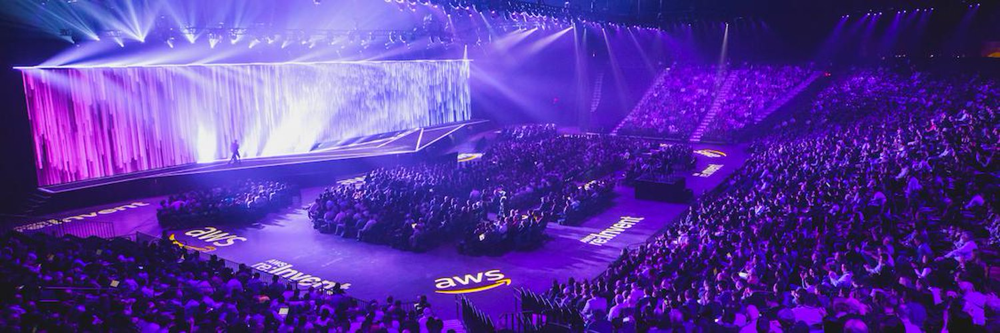

# AWS re:Invent 2019 - Announcements
### The list of the most interesting announcements before and during AWS re:Invent in 2019

---

| Date | News | Link |
| --- | --- | ---|
| 06/11/19 | New – Savings Plans for AWS Compute Services | https://aws.amazon.com/blogs/aws/new-savings-plans-for-aws-compute-services/ |
| 07/11/19 | AWS CLI v2 Preview Now Supports AWS Single Sign-On | https://aws.amazon.com/blogs/developer/aws-cli-v2-now-supports-aws-single-sign-on/ |
| 09/11/19 | Cross-Account Cross-Region Dashboards with Amazon CloudWatch | https://aws.amazon.com/blogs/aws/cross-account-cross-region-dashboards-with-amazon-cloudwatch/ |
| 13/11/19 | New – Import Existing Resources into a CloudFormation Stack | https://aws.amazon.com/blogs/aws/new-import-existing-resources-into-a-cloudformation-stack/ |
| 18/11/19 | Amazon EKS adds support for provisioning and managing Kubernetes worker nodes | https://aws.amazon.com/about-aws/whats-new/2019/11/amazon-eks-adds-support-for-provisioning-and-managing-kubernetes-worker-nodes/ |
| 18/11/19 | CloudFormation Update – CLI + Third-Party Resource Support + Registry | https://aws.amazon.com/blogs/aws/cloudformation-update-cli-third-party-resource-support-registry/ |
| 19/11/19 | New – Application Load Balancer Simplifies Deployment with Weighted Target Groups | https://aws.amazon.com/blogs/aws/new-application-load-balancer-simplifies-deployment-with-weighted-target-groups/ |
| 19/11/19 | Add defense in depth against open firewalls, reverse proxies, and SSRF vulnerabilities with enhancements to the EC2 Instance Metadata Service | https://aws.amazon.com/blogs/security/defense-in-depth-open-firewalls-reverse-proxies-ssrf-vulnerabilities-ec2-instance-metadata-service/ |
| 19/11/19 | AWS Systems Manager Explorer – A Multi-Account, Multi-Region Operations Dashboard | https://aws.amazon.com/blogs/aws/aws-systems-manager-explorer-a-multi-account-multi-region-operations-dashboard/ |
| 19/11/19 | New – Using Step Functions to Orchestrate Amazon EMR Workloads | https://aws.amazon.com/blogs/aws/new-using-step-functions-to-orchestrate-amazon-emr-workloads/ |
| 19/11/19 | Amazon Connect Introduces Web & Mobile Chat for a True Omnichannel Contact Center Experience | https://aws.amazon.com/blogs/aws/new-omnichannel-contact-center-web-and-mobile-chat-for-amazon-connect/ |
| 19/11/19 | AWS Lambda Supports Amazon SQS FIFO (First-In-First-Out) as an Event Source | https://aws.amazon.com/about-aws/whats-new/2019/11/aws-lambda-supports-amazon-sqs-fifo-event-source/ |
| 20/11/19 | New – Amazon EBS Fast Snapshot Restore (FSR) | https://aws.amazon.com/blogs/aws/new-amazon-ebs-fast-snapshot-restore-fsr/ |
| 20/11/19 | S3 Replication Update: Replication SLA, Metrics, and Events | https://aws.amazon.com/blogs/aws/s3-replication-update-replication-sla-metrics-and-events/ |
| 20/11/19 | Welcome to AWS Storage Day | https://aws.amazon.com/blogs/aws/welcome-to-aws-storage-day/ |
| 20/11/19 | Use IAM to share your AWS resources with groups of AWS accounts in AWS Organizations | https://aws.amazon.com/about-aws/whats-new/2019/11/use-iam-share-aws-resources-with-groups-aws-accounts-aws-organizations/ |
| 21/11/19| EventBridge Support in Amazon Elastic Container Registry | https://aws.amazon.com/blogs/aws/eventbridge-support-in-amazon-elastic-container-registry/ |
| 21/11/19 | New – Convert Your Single-Region Amazon DynamoDB Tables to Global Tables | https://aws.amazon.com/blogs/aws/new-convert-your-single-region-amazon-dynamodb-tables-to-global-tables/ | 
| 21/11/19 | Announcing CloudTrail Insights: Identify and Respond to Unusual API Activity | https://aws.amazon.com/blogs/aws/announcing-cloudtrail-insights-identify-and-respond-to-unusual-api-activity/ | 
| 21/11/19 | Announcing Amazon CloudWatch ServiceLens | https://aws.amazon.com/about-aws/whats-new/2019/11/announcing-amazon-cloudwatch-servicelens/ | 
| 22/11/19 | New for Identity Federation – Use Employee Attributes for Access Control in AWS | https://aws.amazon.com/blogs/aws/new-for-identity-federation-use-employee-attributes-for-access-control-in-aws/ |
| 22/11/19 | Using Spatial Data with Amazon Redshift | https://aws.amazon.com/blogs/aws/using-spatial-data-with-amazon-redshift/ |
| 25/11/19 | Visualize and Monitor Highly Distributed Applications with Amazon CloudWatch ServiceLens | https://aws.amazon.com/blogs/aws/visualize-and-monitor-highly-distributed-applications-with-amazon-cloudwatch-servicelens/ |
| 25/11/19 | Announcing AWS Managed Rules for AWS WAF | https://aws.amazon.com/blogs/aws/announcing-aws-managed-rules-for-aws-waf/ |
| 25/11/19 | Introducing Alexa Voice Service Integration for AWS IoT Core, a new way to cost-effectively bring Alexa Voice to any type of connected device | https://aws.amazon.com/blogs/iot/introducing-alexa-voice-service-integration-for-aws-iot-core/ |
| 25/11/19 | AWS Cloud Development Kit (CDK) – Java and .NET are Now Generally Available | https://aws.amazon.com/blogs/aws/aws-cloud-development-kit-cdk-java-and-net-are-now-generally-available/ |
| 25/11/19 | Welcome to AWS IoT Day – Eight Powerful New Features | https://aws.amazon.com/blogs/aws/welcome-to-aws-iot-day/ |
| 25/11/19 | New – AWS IoT Greengrass Adds Container Support and Management of Data Streams at the Edge | https://aws.amazon.com/blogs/aws/new-aws-iot-greengrass-adds-docker-support-and-streams-management-at-the-edge/ |
| 25/11/19 | AWS Lambda Now Supports Maximum Event Age and Maximum Retry Attempts for Asynchronous Invocations | https://aws.amazon.com/about-aws/whats-new/2019/11/aws-lambda-supports-max-retry-attempts-event-age-asynchronous-invocations/ |
| 26/11/19 | AWS Load Balancer Update – Lots of New Features for You! | https://aws.amazon.com/blogs/aws/aws-load-balancer-update-lots-of-new-features-for-you/ |
| 26/11/19 | New – Use Tag Policies to Manage Tags Across Multiple AWS Accounts | https://aws.amazon.com/blogs/aws/new-use-tag-policies-to-manage-tags-across-multiple-aws-accounts/ |
| 26/11/19 | New for Amazon Aurora – Use Machine Learning Directly From Your Databases | https://aws.amazon.com/blogs/aws/new-for-amazon-aurora-use-machine-learning-directly-from-your-databases/ |
| 26/11/19 | AWS Lambda Supports Destinations for Asynchronous Invocations | https://aws.amazon.com/about-aws/whats-new/2019/11/aws-lambda-supports-destinations-for-asynchronous-invocations/ |
| 27/11/19 | AWS DeepRacer Update – New Features & New Racing Opportunities | https://aws.amazon.com/blogs/aws/aws-deepracer-update-new-features-new-racing-opportunities/ |
| 27/11/19 | The Next Evolution in AWS Single Sign-On | https://aws.amazon.com/blogs/aws/the-next-evolution-in-aws-single-sign-on/ |

 

---
## re:Invent News

| Date | News | Link |
| --- | --- | ---|
| 01/12/19 | Introducing Amazon EventBridge schema registry and discovery – In preview | https://aws.amazon.com/blogs/compute/introducing-amazon-eventbridge-schema-registry-and-discovery-in-preview/ |
| 02/12/19 | AWS DeepComposer – Compose Music with Generative Machine Learning Models | https://aws.amazon.com/blogs/aws/aws-deepcomposer-compose-music-with-generative-machine-learning-models/ |
| 02/12/19 | Amazon Transcribe Medical – Real-Time Automatic Speech Recognition for Healthcare Customers | https://aws.amazon.com/blogs/aws/amazon-transcribe-medical-real-time-automatic-speech-recognition-for-healthcare-customers/ |
| 02/12/19 | Automate OS Image Build Pipelines with EC2 Image Builder | 
| 02/12/19 | A New, Simplified, Bring-Your-Own-License Experience for Microsoft Windows Server and SQL Server | https://aws.amazon.com/blogs/aws/a-new-simplified-bring-your-own-license-experience-for-microsoft-windows-server/ |
| 02/12/19 | New AWS Program to Help Future-proof Your End-of-Support Windows Server Applications | https://aws.amazon.com/blogs/aws/new-program-to-future-proof-windows-server-applications/ |
| 02/12/19 | Amazon Transcribe Medical – Real-Time Automatic Speech Recognition for Healthcare Customers | https://aws.amazon.com/blogs/aws/amazon-transcribe-medical-real-time-automatic-speech-recognition-for-healthcare-customers/ |
| 02/12/19 | Introducing Amazon SageMaker Operators for Kubernetes | https://aws.amazon.com/blogs/machine-learning/introducing-amazon-sagemaker-operators-for-kubernetes/ |
| 02/12/19 | Identify Unintended Resource Access with AWS Identity and Access Management (IAM) Access Analyzer | https://aws.amazon.com/blogs/aws/identify-unintended-resource-access-with-aws-identity-and-access-management-iam-access-analyzer/ |
| 02/12/19 | Amazon Braket – Get Started with Quantum Computing | https://aws.amazon.com/blogs/aws/amazon-braket-get-started-with-quantum-computing/ |
| 03/12/19 | AWS Outposts Now Available – Order Your Racks Today | https://aws.amazon.com/blogs/aws/aws-outposts-now-available-order-your-racks-today/ |
| 03/12/19 | Inf1 Instances with AWS Inferentia Chips for High Performance Cost-Effective Inferencing | https://aws.amazon.com/blogs/aws/amazon-ec2-update-inf1-instances-with-aws-inferentia-chips-for-high-performance-cost-effective-inferencing/ |
| 03/12/19 | EBS Direct APIs – Programmatic Access to EBS Snapshot Content | https://aws.amazon.com/blogs/aws/new-programmatic-access-to-ebs-snapshot-content/ |
| 03/12/19 | AWS Compute Optimizer – Your Customized Resource Optimization Service | https://aws.amazon.com/blogs/aws/aws-compute-optimizer-your-customized-resource-optimization-service/ |
| 03/12/19 | Amazon EKS on AWS Fargate Now Generally Available | https://aws.amazon.com/blogs/aws/amazon-eks-on-aws-fargate-now-generally-available/ |
| 03/12/19 | AWS Fargate Spot Now Generally Available | https://aws.amazon.com/blogs/aws/aws-fargate-spot-now-generally-available/ |
| 03/12/19 | ECS Cluster Auto Scaling is Now Generally Available | https://aws.amazon.com/blogs/aws/aws-ecs-cluster-auto-scaling-is-now-generally-available/ | 
| 03/12/19 | Easily Manage Shared Data Sets with Amazon S3 Access Points | https://aws.amazon.com/blogs/aws/easily-manage-shared-data-sets-with-amazon-s3-access-points/ | 
| 03/12/19 | Amazon Redshift Update – Next-Generation Compute Instances and Managed, Analytics-Optimized Storage | https://aws.amazon.com/blogs/aws/amazon-redshift-update-next-generation-compute-instances-and-managed-analytics-optimized-storage/ |
| 03/12/19 | Amazon Redshift – Data Lake Export and Federated Queries | https://aws.amazon.com/blogs/aws/new-for-amazon-redshift-data-lake-export-and-federated-queries/ |
| 03/12/19 | Amazon Rekognition Custom Labels | https://aws.amazon.com/blogs/machine-learning/announcing-amazon-rekognition-custom-labels/ | 
| 03/12/19 | Amazon SageMaker Studio: The First Fully Integrated Development Environment For Machine Learning | https://aws.amazon.com/blogs/aws/amazon-sagemaker-studio-the-first-fully-integrated-development-environment-for-machine-learning/ |
| 03/12/19 | Amazon SageMaker Model Monitor – Fully Managed Automatic Monitoring For Your Machine Learning Models | https://aws.amazon.com/blogs/aws/amazon-sagemaker-model-monitor-fully-managed-automatic-monitoring-for-your-machine-learning-models/ |
| 03/12/19 | Amazon SageMaker Experiments – Organize, Track And Compare Your Machine Learning Trainings | https://aws.amazon.com/blogs/aws/amazon-sagemaker-experiments-organize-track-and-compare-your-machine-learning-trainings/ |
| 03/12/19 | Amazon SageMaker Debugger – Debug Your Machine Learning Models | https://aws.amazon.com/blogs/aws/amazon-sagemaker-debugger-debug-your-machine-learning-models/ |
| 03/12/19 | Amazon SageMaker Autopilot – Automatically Create High-Quality Machine Learning Models | https://aws.amazon.com/blogs/aws/amazon-sagemaker-autopilot-fully-managed-automatic-machine-learning/ |
| 03/12/19 | Now Available on Amazon SageMaker: The Deep Graph Library | https://aws.amazon.com/blogs/aws/now-available-on-amazon-sagemaker-the-deep-graph-library/ |
|03/12/19 | Amazon SageMaker Processing – Fully Managed Data Processing and Model Evaluation | https://aws.amazon.com/blogs/aws/amazon-sagemaker-processing-fully-managed-data-processing-and-model-evaluation/ |
| 03/12/19 | Deep Java Library (DJL) | https://towardsdatascience.com/introducing-deep-java-library-djl-9de98de8c6ca |
| 03/12/19 | AWS Now Available from a Local Zone in Los Angeles | https://aws.amazon.com/blogs/aws/aws-now-available-from-a-local-zone-in-los-angeles/ |
| 03/12/19 | Lambda Provisioned Concurrency | https://aws.amazon.com/blogs/aws/new-provisioned-concurrency-for-lambda-functions |
| 03/12/19 | AWS Step Functions Express Workflows: High Performance & Low Cost | https://aws.amazon.com/blogs/aws/new-aws-step-functions-express-workflows-high-performance-low-cost/ |
| 03/12/19 | AWS Transit Gateway – Build Global Networks and Centralize Monitoring Using Network Manager | https://aws.amazon.com/blogs/aws/new-for-aws-transit-gateway-build-global-networks-and-centralize-monitoring-using-network-manager/ |
| 03/12/19 | AWS Transit Gateway Adds Multicast and Inter-regional Peering | https://aws.amazon.com/blogs/aws/aws-transit-gateway-adds-multicast-and-inter-regional-peering/ |
| 03/12/19 | VPC Ingress Routing – Simplifying Integration of Third-Party Appliances | https://aws.amazon.com/blogs/aws/new-vpc-ingress-routing-simplifying-integration-of-third-party-appliances/ |
| 03/12/19 | Amazon Chime Meeting Regions | https://aws.amazon.com/blogs/business-productivity/amazon-chime-meetings-14-aws-regions/ |
| 03/12/19 | AWS Wavelength - Preview | https://aws.amazon.com/wavelength/ |
| 03/12/19 | New – Amazon Managed Apache Cassandra Service (MCS) - Preview | https://aws.amazon.com/blogs/aws/new-amazon-managed-apache-cassandra-service-mcs/ |
| 03/12/19 | Coming Soon – Graviton2-Powered General Purpose, Compute-Optimized, & Memory-Optimized EC2 Instances | https://aws.amazon.com/blogs/aws/coming-soon-graviton2-powered-general-purpose-compute-optimized-memory-optimized-ec2-instances/ |
| 03/12/19 | Amazon Fraud Detector - Preview | http://aws.amazon.com/fraud-detector |
| 03/12/19 | Amazon Kendra - Preview | https://aws.amazon.com/kendra |
| 03/12/19 | Contact Lens for Amazon Connect Preview | https://pages.awscloud.com/contact-lens-preview.html |
| 03/12/19 | Amazon CodeGuru - Preview | https://aws.amazon.com/codeguru/ |
| 03/12/19 | Amazon RDS Proxy | http://aws.amazon.com/rds/proxy |
| 04/12/19 | Amplify DataStore – Simplify Development of Offline Apps with GraphQL | https://aws.amazon.com/blogs/aws/amplify-datastore-simplify-development-of-offline-apps-with-graphql/ |
| 04/12/19 | Announcing HTTP APIs for Amazon API Gateway - (Preview) | https://aws.amazon.com/blogs/compute/announcing-http-apis-for-amazon-api-gateway/ |
| 04/12/19 | Introducing Amplify for iOS and Android | https://aws.amazon.com/about-aws/whats-new/2019/12/introducing-amplify-for-ios-and-android/ |
| 04/12/19 | Announcing the Amazon Chime Meetings App for Slack | https://aws.amazon.com/blogs/business-productivity/announcing-amazon-chime-meetings-app-for-slack/ |
| 05/12/19 | Check out The Amazon Builders’ Library – This is How We Do It! | https://aws.amazon.com/blogs/aws/check-out-the-amazon-builders-library-this-is-how-we-do-it/ |

 
 

*Author: [Luke Dorosz](https://twitter.com/mrdoro)* & [Przemek Malak](https://twitter.com/PrzemekM72)
